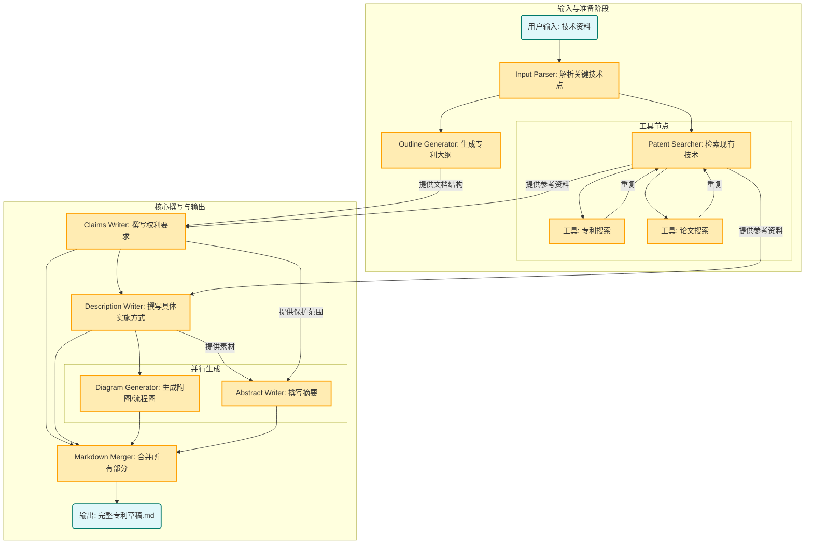

# PatentWriterAgent - 专利写作多智能体系统

基于 Claude Code 子代理（subagent）架构，将技术交底书（.docx）自动转换为符合中国《专利法》规范的完整专利申请文件。

## 特性

- 8 阶段流水线：文档解析 → 专利检索 → 大纲生成 → 摘要撰写 → 权利要求书 → 说明书 → 图表生成 → 文档合并
- 具体实施方式自动生成 >10000 字，实施例 ≤3 个
- 方法+装置+设备+介质四类独立权利要求全覆盖
- Mermaid 格式专利附图自动生成
- 支持 Google Patents + Exa 在线专利检索（可选）

## 快速开始

### 方式一：CLI 模式

```bash
# 1. 安装 Claude Code
npm install -g @anthropic-ai/claude-code

# 2. 安装 Python 依赖
pip install -r requirements.txt

# 3. 配置环境（按需修改 API KEY）
cp .mcp.json.example .mcp.json
cp .claude/settings.local.json.example .claude/settings.local.json

# 4. 执行专利生成
claude --dangerously-skip-permissions "根据 data/输入.docx 编写专利提案" -p --output-format stream-json --verbose
```

### 方式二：Skill 模式

将 `patent-writer/` 目录复制到 `~/.claude/skills/` 下，或安装 `patent-writer.skill` 文件，即可在任意项目中通过自然语言触发专利写作：

```
帮我根据这份技术交底书撰写专利申请
```

### 方式三：Docker

```bash
docker build -t patent-writer .
docker run -p 8009:8009 patent-writer
```

## 配置说明

### MCP 工具（可选）

编辑 `.mcp.json`，填入以下 API KEY：

- `SERPAPI_API_KEY`：用于 Google Patents 专利检索
- `EXA_API_KEY`：用于 Exa 技术文献搜索

若不配置，系统将跳过专利检索阶段，直接基于交底书内容生成。

### 第三方模型（可选）

编辑 `.claude/settings.local.json`，可配置第三方模型（如智谱 GLM）替代 Anthropic 官方模型。不使用第三方模型则删除 `ANTHROPIC_` 开头的环境变量即可。

## 架构设计

### 子代理流水线（严格顺序执行）

```
input-parser → patent-searcher → outline-generator → abstract-writer
→ claims-writer → description-writer → diagram-generator → markdown-merger
```

| 子代理 | 职责 | 输出 |
|--------|------|------|
| input-parser | 解析 docx 技术交底书 | `01_input/parsed_info.json` |
| patent-searcher | 检索相似专利和技术文献 | `02_research/similar_patents.json` |
| outline-generator | 设计专利大纲 | `03_outline/patent_outline.md` |
| abstract-writer | 撰写说明书摘要（≤300字） | `04_content/abstract.md` |
| claims-writer | 撰写权利要求书 | `04_content/claims.md` |
| description-writer | 撰写说明书（>10000字） | `04_content/description.md` |
| diagram-generator | 生成 Mermaid 附图 | `05_diagrams/**/*.mmd` |
| markdown-merger | 合并为完整专利文件 | `06_final/complete_patent.md` |

### Workflow 设计



## 输出目录结构

每次执行创建 `output/temp_[uuid]/`：

```
output/temp_[uuid]/
├── 01_input/          # 解析后的结构化数据
├── 02_research/       # 专利检索结果
├── 03_outline/        # 专利大纲
├── 04_content/        # 摘要、权利要求书、说明书
├── 05_diagrams/       # Mermaid 图表
└── 06_final/          # 最终合并的完整专利文件
```

示例输出参见：`output/temp_9ba0a678-5210-42e0-8f52-31b47bf630f6/`

## 关键文件

| 文件 | 说明 |
|------|------|
| `CLAUDE.md` | 主代理编排指令 |
| `PATENT_SKILL.md` | 专利撰写规范指南（832行） |
| `.claude/agents/*.md` | 8 个子代理定义 |
| `patent-writer/` | 封装后的 Skill 目录 |
| `patent-writer.skill` | 可分发的 Skill 包 |
| `data/example_patent.md` | 示例专利输出 |

## 许可证

[AGPL-3.0](LICENSE)
