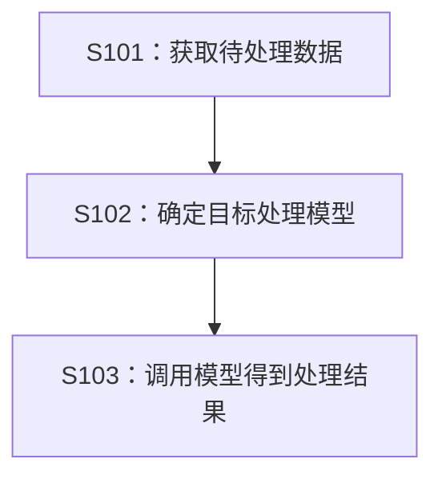
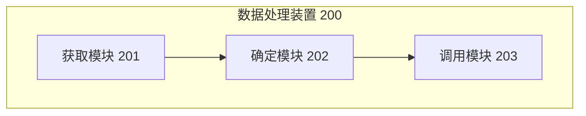

# 阶段 7：图表生成（diagram-generator）

使用 Mermaid 语法生成专利附图。执行前必须先读取 `references/patent-writing-guide.md`。

## 执行步骤

1. 读取 `04_content/description.md` 和 `03_outline/structure_mapping.json`
2. 生成以下 Mermaid 图表：
   - 方法流程图（graph TD）：展示步骤顺序
   - 装置结构图（graph TB）：展示模块组成
   - 系统架构图（graph LR）：展示系统整体
3. 保存为独立的 `.mmd` 文件到 `05_diagrams/` 目录

## 图表示例

**方法流程图：**

**装置结构图：**

## 要求

- 步骤编号必须与具体实施方式一致
- 模块编号必须与装置描述对应
- 图表清晰、简洁、符合专利规范
